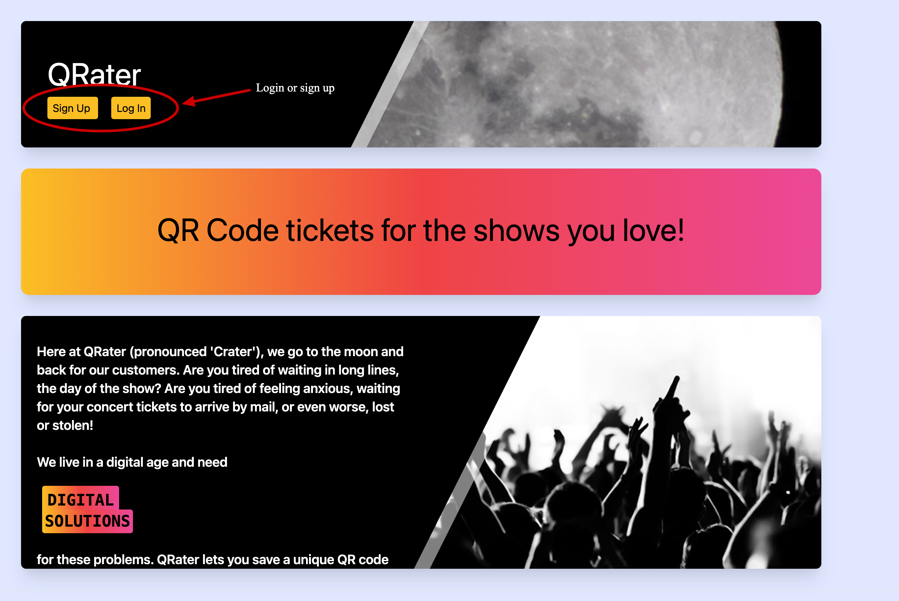
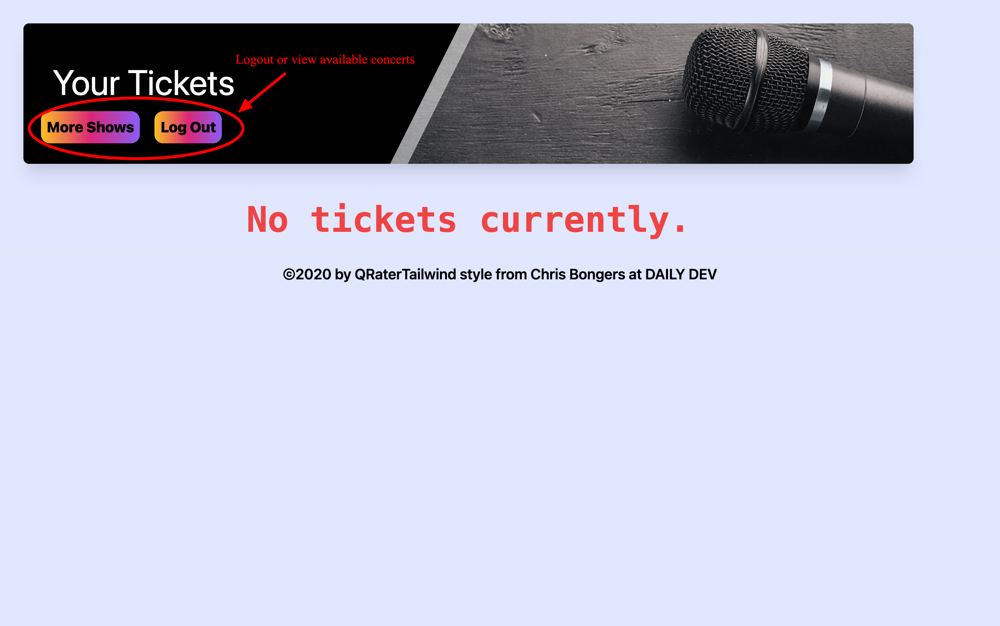
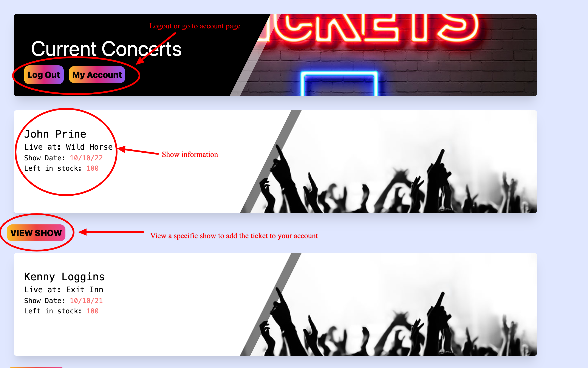
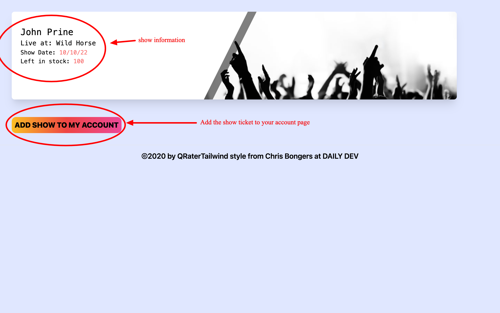
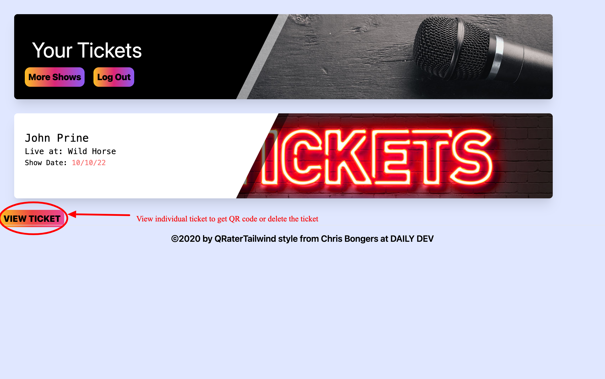
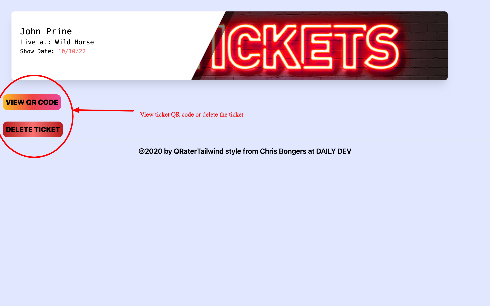
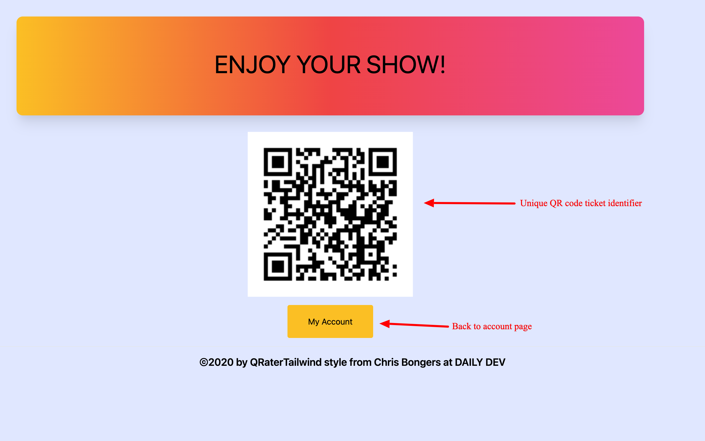

# QR-Ticket-Generator

## Description
A simple CMS-style website, with a focus on MVC systems in the architectural structure. Using templates from Handlebars.js, Sequelize as the ORM, and Expess-session npm for authentication. Tailwind CSS has been used for all styling. The QR-Ticket-Generator allows the storage of concert tickets in an account for users. When the user wishes they can view a unique QR code for the selected ticket. It tracks user login information, tickets owned, and the corresponding venues for the show. Future enhancements include but are not limited to, bill and payment tracking, ticket redemption via QR code, directions to the concert venue, and concert ratings and comments post show.

You can access more badges and their purposes at [shields.io](https://shields.io)

## Technologies

## Table of Contents
  * [The Application](#application)
  * [User Login or Sign Up](#login)
  * [User's Account](#account)
  * [Available Concerts](#shows)
  * [Add Concerts](#add)
  * [View Your Tickets](#view)
  * [Developer Roles](#roles)
  * [Questions](#questions)
  * [License](#license)

&nbsp

## Application
  

&nbsp

## Login

A user may login or sign up once at the homepage of the QRaters website.
  

&nbsp

&nbsp

## Account

Once a user has either completed the sign-up form or has logged in again, they are taken to their account page. The user's account page will contain any tickets the user currently has, or let them know they currently have no tickets to shows. As a new user this will be the default. You are also presented to logout, which will take you back to the homepage to sign-up or login again. You can choose to view all the available shows as well.

&nbsp

&nbsp

## Shows

After selecting the `More Shows` button, you are taken to a page that displays the current list of available concerts. Each concert has the name of the artist, the venue, the date of the show, and the ticket's available stock. You can choose to go back to your account page, log out to the homepage, or view one show in particular. _The ticket's available stock will be a future feature enhancement that will allow the user to track the available tickets for purchase._

&nbsp

&nbsp

## Add Shows

Once on the single-concert page you can then add the show to your account. It will automatically return you to your account page.

&nbsp

&nbsp

## View Ticket 

Another option once you have added tickets to your account page, is that you can view each individual ticket to view the qr code, or to delete the ticket from your account entirely. Should you choose to delete the ticket you will be taken back to your account page which will no longer have the concert ticket available. The QR code option will show you the unique QR code that was made specifically for that ticket. It will be the same for that ticket and that ticket only. _A future feature enhancement will be that the ticket is validated and redeemed through this QR code._ 

&nbsp

&nbsp

&nbsp

&nbsp

&nbsp

&nbsp

## Roles
* John Banas: Full-stack
* Manuel Duron: Front-end/framework
* Joseph Suvak: Back-end/server
* Walter Scimone: Back-end/server
* Freddy Lucio: Front-end/framework
* Casey Arrington: Db/Sequelize Models

&nbsp

## Questions
      
  _For further questions/comments regarding this application please feel free to contact the development team:_

  * John Banas: [GitHub](https://github.com/JohnBanas)
  * Manuel Duron: [GitHub](https://github.com/manniemd)
  * Joseph Suvak: [GitHub](https://github.com/JosephSuvak)
  * Walter Scimone: [GitHub](https://github.com/Walterego95)
  * Freddy Lucio: [GitHub](https://github.com/fredlucio)
  * Casey Arrington: [GitHub](https://github.com/carrington13)

  

  
&nbsp

    
## License

      
  _This application has the MIT License._
      
  For more information please view the [license description](https://choosealicense.com/licenses/mit/)